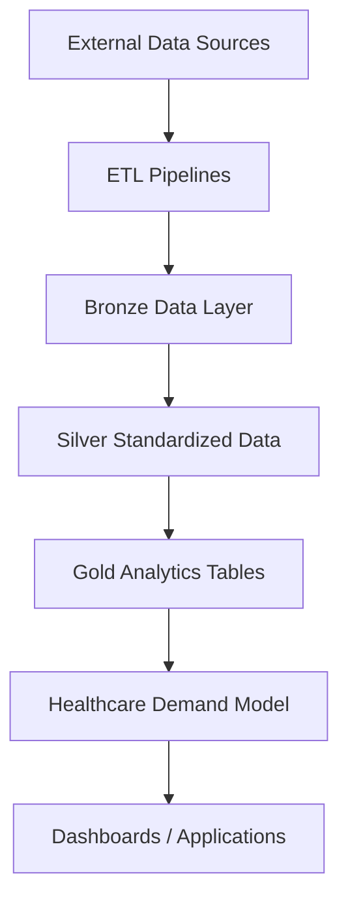

# HealthCare Informatics Hub (healthcareinformaticshub.com)

HealthCare Informatics Hub is a prototype healthcare analytics platform designed to explore how modern data platforms can integrate public health and demographic datasets to generate insights on regional healthcare demand.

This project is being developed as a hands-on learning environment while preparing for the Microsoft DP-600 (Fabric Analytics Engineer) certification.

The goal is to simulate how a healthcare analytics platform could help identify regions where healthcare infrastructure may not meet population needs.

---

## Platform Architecture

The platform follows a modern data platform architecture inspired by cloud analytics systems.

External Data Sources
↓
ETL Pipelines
↓
Bronze Layer (Raw Data)
↓
Silver Layer (Standardized Data)
↓
Gold Layer (Analytics Datasets)
↓
Healthcare Demand Model
↓
Dashboards / Applications

---

## Key Concepts Implemented

• Medallion Data Architecture (Bronze / Silver / Gold)

• Healthcare analytics data model

• Python-based ETL pipelines

• Population and healthcare infrastructure datasets

• Healthcare demand scoring model

• Cloud-ready architecture for Microsoft Fabric and Azure

---

## Repository Structure
## Architecture Overview

---

## Project Status

This project is currently in the **prototype / architecture phase**.

Next development milestones include:

• Implementing the first ETL pipeline using the Philippines hospital registry dataset  
• Building the first healthcare demand dataset  
• Integrating analytics with Power BI  
• Migrating the pipeline architecture to Microsoft Fabric

---

## Purpose

The long-term goal of this project is to explore how modern data platforms can support healthcare analytics, infrastructure planning, and population health insights using publicly available data.

